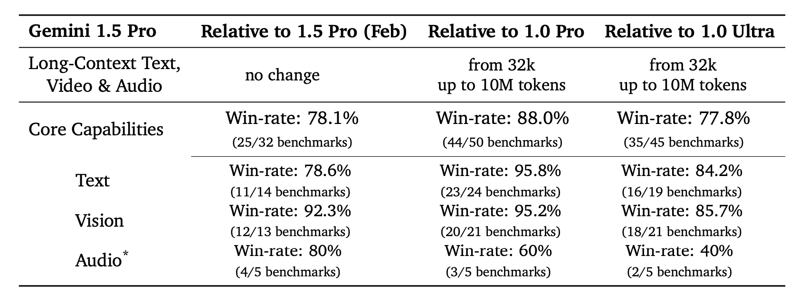
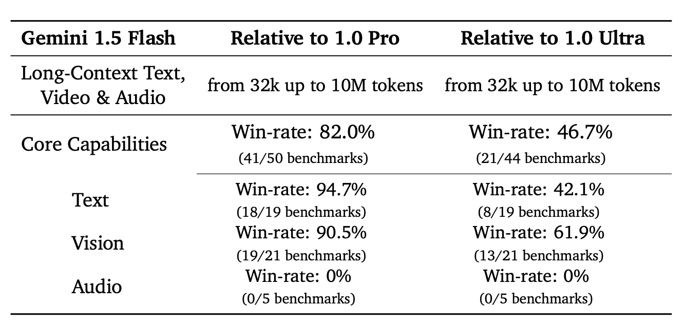
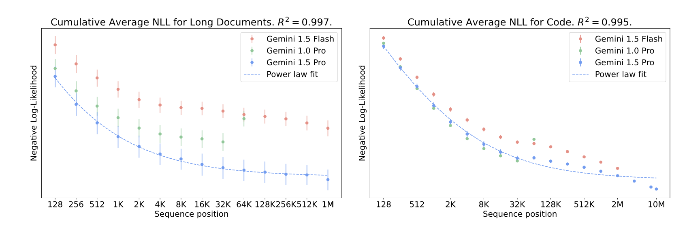
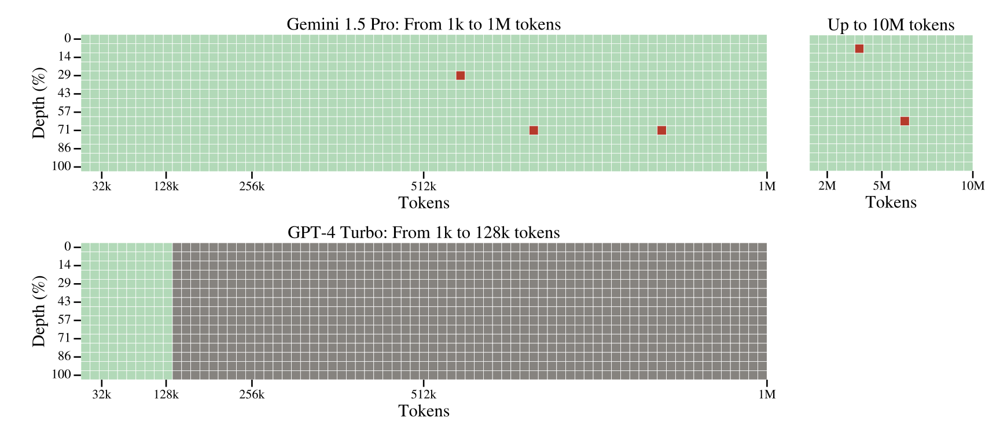
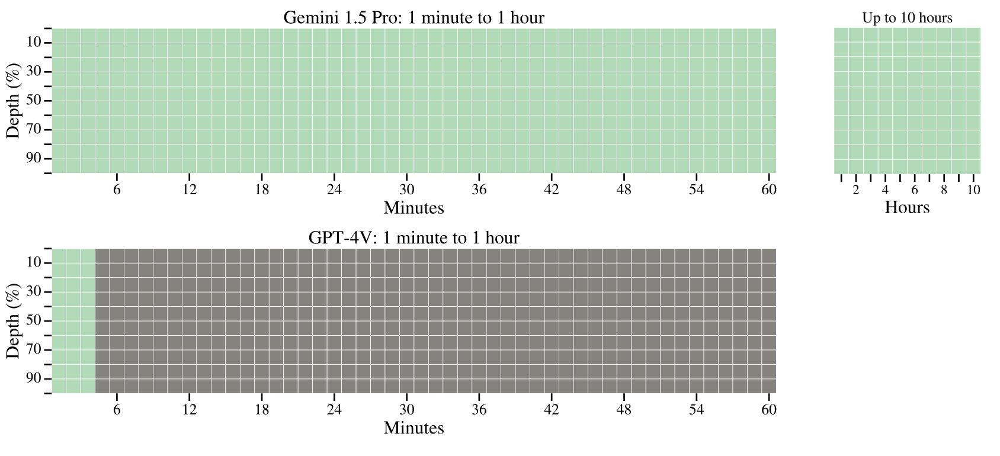
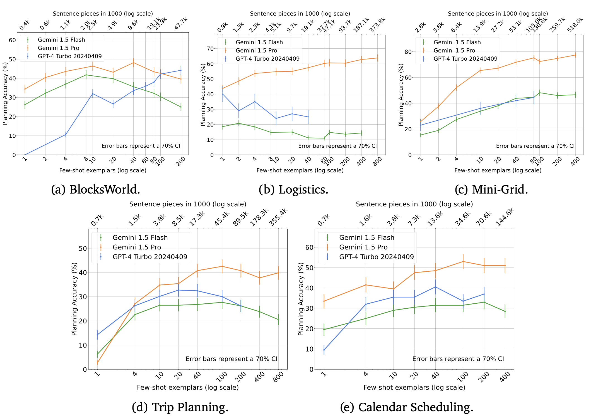
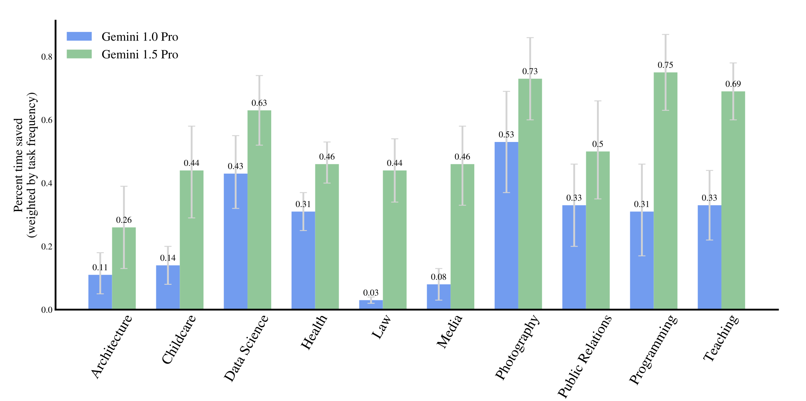
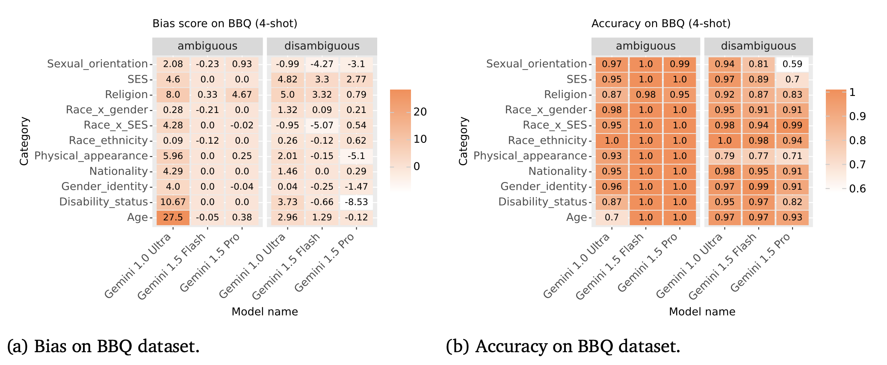
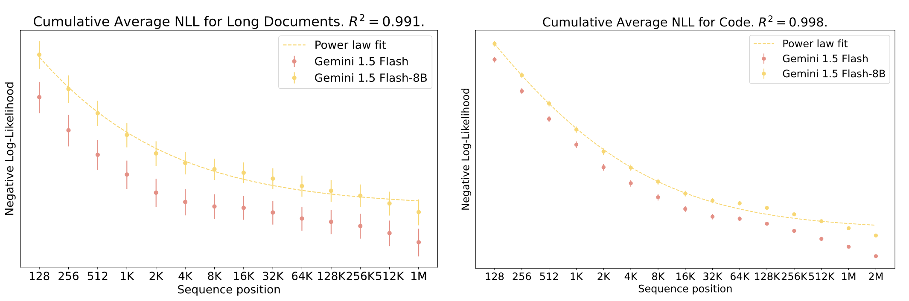

# Gemini 1.5 Paper Presentation

## Table of Contents
- [Overview](#overview)
- [Technical Architecture](#technical-architecture)
  - [Key Architectural Components](#key-architectural-components)
  - [Pseudocode](#pseudocode)
- [Performance Analysis](#performance-analysis)
  - [Core Model Performance](#core-model-performance)
  - [Long-Context Evaluation](#long-context-evaluation)
  - [Scaling and Learning](#scaling-and-learning)
- [Real-World Applications and Impact](#real-world-applications-and-impact)
  - [Real World Deployment Challenges](#real-world-deployment-challenges)
- [Safety and Future Directions](#safety-and-future-directions)
  - [Safety Analysis](#safety-analysis)
  - [Future Scaling](#future-scaling)
- [Resources & References](#resources--references)
- [Citation](#citation)

## Overview


*This figure shows near-perfect "needle" recall across all modalities (text, video, audio), demonstrating the model's unprecedented multimodal capabilities at scale. This is an excellent opening visual as it immediately shows the paper's key achievement.*

This repository contains materials for a presentation on the paper "Gemini 1.5: Unlocking multimodal understanding across millions of tokens of context" by the Gemini Team at Google.

### Context and Problem Statement

The Gemini 1.5 paper introduces a groundbreaking family of multimodal models addressing several key limitations in existing AI systems:
- Context length limitations (~200K tokens in previous models)
- Multimodal integration challenges
- Compute efficiency requirements
- Safety concerns

## Technical Architecture

The architecture comprises two main models:
1. Gemini 1.5 Pro
   - Sparse mixture-of-experts (MoE) Transformer-based model
   - Capable of processing up to 10M tokens
   - State-of-the-art performance on long-context tasks
2. Gemini 1.5 Flash
   - More lightweight variant designed for efficient inference
   - Online distilled from Pro model
   - Maintains strong performance with better efficiency


```
Key Architectural Components:

1. Input Processing:
   - Tokenize multimodal input (text, images, audio, video)
   - Convert to shared embedding space
   - Handle variable-length sequences up to 10M tokens

2. Transformer Layers with MoE:
   for each layer in transformer_layers:
       # Attention mechanism
       attention_output = scaled_dot_product_attention(
           query=current_tokens,
           key=context_window,
           value=context_window
       )

       # MoE routing
       experts = select_top_k_experts(attention_output)
       expert_outputs = []
       for token in attention_output:
           relevant_expert = route_to_expert(token)
           expert_output = relevant_expert.process(token)
           expert_outputs.append(expert_output)

       # Combine expert outputs
       layer_output = aggregate_expert_outputs(expert_outputs)

3. Long-Context Processing:
   - Implement sparse attention patterns
   - Use sliding window mechanisms
   - Maintain gradient flow across long sequences

4. Multimodal Integration:
   - Cross-attention between modalities
   - Shared representation space
   - Modality-specific preprocessing
```

Pseudocode
```
/* Gemini 1.5 Pro, a sparse mixture-of-experts (MoE) Transformer with long-context capabilities */

Input: x ∈ V*, a sequence of multimodal tokens (text, image, audio, or video).
Output: P ∈ (0, 1)^(N_v×length(x)), output distribution for next token prediction.
Hyperparameters: L_max, L, H, d_e, d_mlp, n_experts ∈ ℕ
Parameters: θ includes all model parameters (embeddings, attention, MLP, layer norms, etc.)

1  ℓ ← length(x)
2  X ← Embed_and_Process_Input(x)  // Handle different modalities
3  for l = 1, 2, ..., L do
4      X_res ← X
5      X ← LayerNorm(X)
6      X ← X + MultiHeadAttention(X, X, X, mask=CausalMask(ℓ))
7      X ← LayerNorm(X)
8      E ← Router(X)  // Select top-k experts for each token
9      X_moe ← SparseMoEComputation(X, E)
10     X ← X_res + X + X_moe  // Residual connections
11 end
12 X ← LayerNorm(X)
13 return P = softmax(LinearProjection(X))

Subroutine: Embed_and_Process_Input(x)
    // Handle different input modalities (text, image, audio, video)
    // Apply appropriate embeddings and preprocessing

Subroutine: MultiHeadAttention(Q, K, V, mask)
    // Implement efficient long-context attention
    // Use techniques like sparse attention patterns or sliding windows

Subroutine: Router(X)
    // Implement expert selection logic
    // Return top-k experts for each token

Subroutine: SparseMoEComputation(X, E)
    // Perform sparse MoE computation
    output ← 0
    for i = 1 to n_experts do
        if E[i] selected:
            output += E[i].weight * MLP_i(X)
    return output

Subroutine: MLP_i(X)
    // Individual expert computation
    return GELU(Linear(X))
```

## Performance Analysis

### Core Model Performance


*These tables provide comprehensive win rates comparing Gemini 1.5 Pro and Flash against previous models, showing improvements across different capabilities.*


*These graphs showing cumulative average negative log-likelihood demonstrate how performance improves with increased context length, following a power-law distribution.*

### Long-Context Evaluation

*Text haystack results showing performance across different context lengths and depths, demonstrating robust retrieval capabilities up to 10M tokens.*


*Video haystack results extending similar evaluation to video content, showing strong performance up to 10.5 hours of video.*

### Scaling and Learning

*In-context learning scaling results showing improved performance across languages and tasks with increased context.*

## Real-World Applications and Impact


*Planning capabilities across different domains, demonstrating practical applications from classical planning to natural language tasks.*


*Professional impact analysis showing significant time savings across various industries and job functions.*

### Real World Deployment Challenges


## Safety and Future Directions

### Safety Analysis

*BBQ dataset results demonstrating model performance on bias and fairness metrics.*

### Future Scaling

*Flash-8B model results showing potential for efficient scaling while maintaining strong performance.*


## Resources & References

1. [Gemini 1.5 Technical Report](https://storage.googleapis.com/deepmind-media/gemini/gemini_1_5_report.pdf)
2. [Google AI Blog on Gemini](https://ai.googleblog.com/)
3. [Mixture of Experts Explained](https://arxiv.org/abs/2101.03961)
4. [Attention Is All You Need (Transformer architecture)](https://arxiv.org/abs/1706.03762)
5. [LLM Efficiency Techniques](https://arxiv.org/abs/2303.06865)

## Citation

```
Gemini Team, Google. (2024). Gemini 1.5: Unlocking multimodal understanding across millions of tokens of context. arXiv preprint arXiv:2403.05530v4.
```
